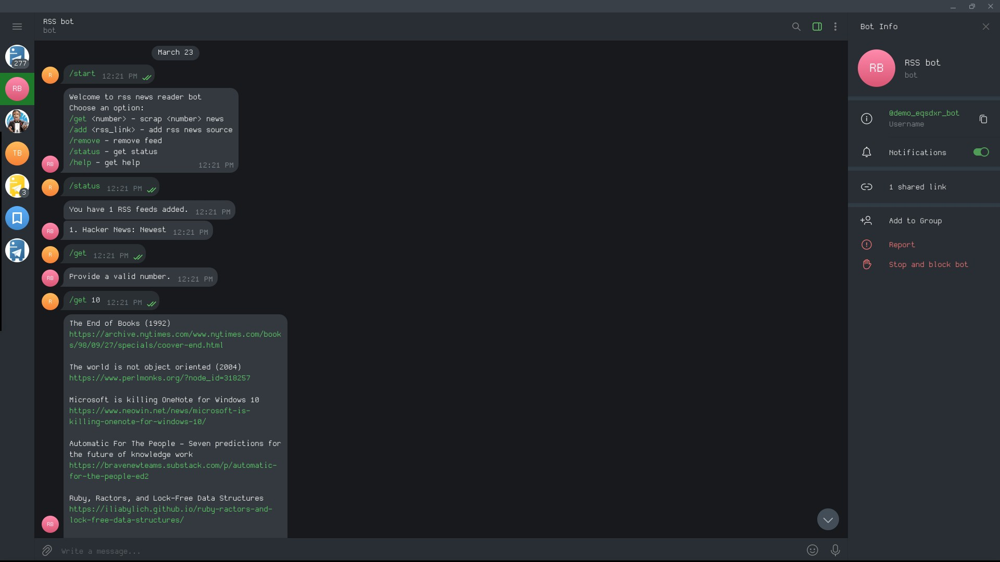

An example of a telegram bot bulit with [python-telegram-bot](https://github.com/python-telegram-bot/python-telegram-bot), MongoDB, and Docker.

**Try the bot**: [demo](https://t.me/demo_eqsdxr_bot).

> Note: Response times may vary since the bot runs on a free plan.

Project highlights:
- Built with [python-telegram-bot](https://github.com/python-telegram-bot/python-telegram-bot) framework
- Uses MongoDB for data storage
- Dockerized for easy deployment
- Includes unit tests
- Implements RSS functionality using [feedparser](https://pypi.org/project/feedparser/) library

